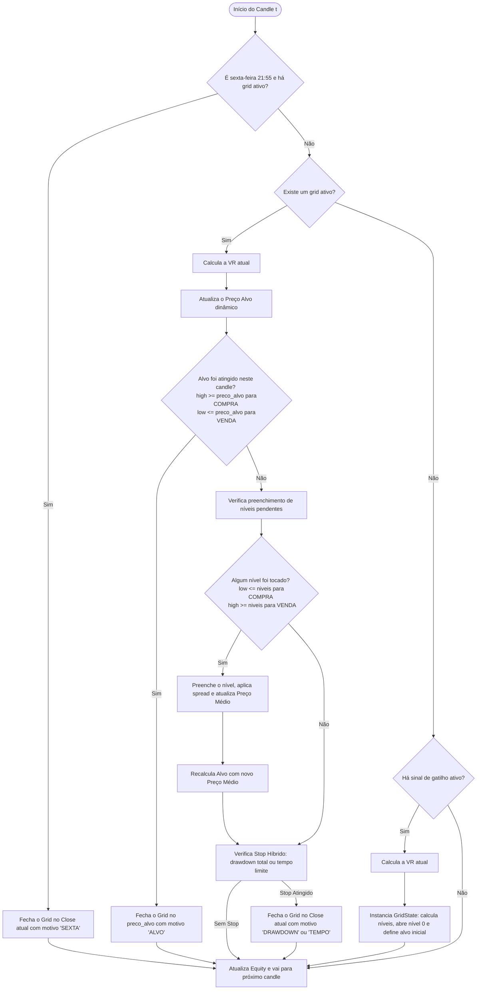

# Manual Técnico do Sistema de Grid Trading (EURUSD H1)

Este documento detalha o funcionamento, as regras operacionais, o fluxo de execução candle-a-candle e todas as fórmulas matemáticas utilizadas para o cálculo dos parâmetros de risco, níveis e gatilhos no sistema de **Grid Trading quantitativo**.

---

## 1. Filosofia e Regras Absolutas

O sistema foi desenhado para operar **contra a tendência** (reversão à média) no par EURUSD no tempo gráfico H1. Ele é regido por regras estritas de execução:

1. **Operação Contra a Tendência (Mean Reversion)**: O sistema entra em COMPRA quando o mercado cai acentuadamente e em VENDA quando o mercado sobe acentuadamente.
2. **Máximo de 8 Ordens**: O grid é limitado a no máximo $MAX\_ORDENS = 8$ níveis.
3. **Níveis Pré-Calculados na Abertura**: Ao disparar o gatilho, a Volatilidade Realizada (VR) é calculada e todos os 8 níveis de preço são imediatamente determinados e congelados.
4. **Espaçamento Dinâmico por VR**: O espaçamento em pips entre os níveis é calculado com base na VR do momento da abertura do grid.
5. **Alvo Dinâmico por Candle**: O preço alvo é recalculado a cada candle usando a VR atual.
6. **Saída por Preço Médio Ponderado**: A saída do grid (seja por alvo ou por stop) fecha todas as ordens abertas simultaneamente com base no preço médio ponderado por lote.
7. **Stop Híbrido**: O grid possui dois mecanismos de stop automáticos: limite de drawdown flutuante (baseado em pips e escalonado pelo número de ordens ativas) e limite de tempo (número máximo de candles).
8. **Fechamento Compulsório de Sexta-feira**: Para evitar o risco de gaps de abertura no final de semana, qualquer grid ativo é obrigatoriamente fechado na sexta-feira às **21h55** (horário do servidor MT5).

---

## 2. Parâmetros e Constantes Globais

Definidos no arquivo de configuração [config.py](file:///c:/Users/cesar/.gemini/antigravity/scratch/Quant_Matematica.Trade/quant_grid/config.py):

*   $MAX\_ORDENS = 8$ (Número máximo de níveis de preço)
*   $SPREAD\_PIPS = 1.0$ (Spread fixo simulado por entrada em pips)
*   $PIP\_VALUE\_POR\_LOT = 10.0$ (Valor monetário de 1 pip para 1.0 lote padrão de EURUSD)
*   $FATOR\_PIPS = 10000$ (Fator de conversão de preço para pips: $10^4$)
*   $LOT\_SIZE = 0.1$ (Lote padrão por nível)
*   $CAPITAL\_INICIAL = 10000.0$ (Capital inicial da simulação em USD)
*   $HORA\_FECHAMENTO\_SEXTA = 21$, $MIN\_FECHAMENTO\_SEXTA = 55$
*   $JANELA\_VR = 50$ (Período do desvio padrão rolling para a Volatilidade Realizada)

---

## 3. Cálculos de Risco e Volatilidade

Todos os parâmetros dinâmicos são calculados a partir da **Volatilidade Realizada (VR)** medida em pips.

### 3.1. Volatilidade Realizada (VR) atual
A VR é baseada no desvio padrão dos log-retornos dos últimos $N = 50$ candles ($JANELA\_VR$), convertida para a escala de preço atual e expressa em pips.

$$log\_return_t = \ln\left(\frac{Close_t}{Close_{t-1}}\right)$$

$$\sigma_{frac} = \text{std}(log\_return_{t-49..t}, \text{ddof}=1)$$

$$VR_{pips} = \sigma_{frac} \times Close_t \times FATOR\_PIPS$$

*Implementado na função [calcular_vr_atual](file:///c:/Users/cesar/.gemini/antigravity/scratch/Quant_Matematica.Trade/quant_grid/core/grid_risk.py#L16-L54).*

### 3.2. Espaçamento entre Níveis
O espaçamento é linear e fixo para a vida de um grid, calculado no momento da abertura:

$$espacamento\_pips = \text{clip}(mult\_espacamento \times VR_{abertura}, 3.0, 50.0)$$

*   **Clipping**: O espaçamento é limitado a um mínimo de $3.0$ pips e máximo de $50.0$ pips para evitar grids excessivamente colados ou espaçados.
*Implementado na função [calcular_espacamento_pips](file:///c:/Users/cesar/.gemini/antigravity/scratch/Quant_Matematica.Trade/quant_grid/core/grid_risk.py#L56-L79).*

### 3.3. Alvo Dinâmico de Saída
O alvo de lucro é dinâmico e recalculado no início de cada candle com base na volatilidade do momento ($VR_{atual}$):

$$alvo\_pips = \text{clip}(mult\_alvo \times VR_{atual}, 5.0, 100.0)$$

*   **Clipping**: O alvo em pips é limitado entre $5.0$ pips e $100.0$ pips.
*   **Preço do Alvo**:
    *   **COMPRA**: $preco\_alvo = preco\_medio + \frac{alvo\_pips}{FATOR\_PIPS}$
    *   **VENDA**: $preco\_alvo = preco\_medio - \frac{alvo\_pips}{FATOR\_PIPS}$
*Implementado no método [atualizar_alvo](file:///c:/Users/cesar/.gemini/antigravity/scratch/Quant_Matematica.Trade/quant_grid/core/grid_engine.py#L219-L243).*

### 3.4. Stop de Drawdown Dinâmico
O stop de perda baseia-se em um drawdown máximo medido em pips a partir do preço médio. O limite é proporcional ao número de ordens ativas ($n$), permitindo maior tolerância à medida que o grid se expande:

$$stop\_dd\_pips = \text{clip}(mult\_stop \times VR_{atual} \times n, 10.0, 200.0)$$

*   **Clipping**: O stop total em pips é limitado entre $10.0$ pips e $200.0$ pips.
*Implementado na função [calcular_stop_drawdown_pips](file:///c:/Users/cesar/.gemini/antigravity/scratch/Quant_Matematica.Trade/quant_grid/core/grid_risk.py#L81-L110).*

---

## 4. Funcionamento do GridState e Níveis de Preço

Quando o gatilho é disparado, a classe [GridState](file:///c:/Users/cesar/.gemini/antigravity/scratch/Quant_Matematica.Trade/quant_grid/core/grid_engine.py#L17) é instanciada e executa o pré-cálculo dos 8 níveis de preço.

### 4.1. Definição Nominal dos Níveis
Seja $P_{ini}$ o preço de fechamento do candle de disparo e $passo = \frac{espacamento\_pips}{FATOR\_PIPS}$. 

O primeiro nível ($niveis[0]$) recebe o desconto de spread inicial imediatamente. Metade do spread é descontado de forma desfavorável à nossa entrada (simulando a compra no Ask ou venda no Bid):

$$spread\_price = \frac{SPREAD\_PIPS}{2 \times FATOR\_PIPS} = 0.00005$$

**Para COMPRA (direção = +1):**
*   $niveis[0] = P_{ini} - spread\_price$
*   $niveis[i] = niveis[i-1] - passo \quad \text{para } i \in [1..7]$

**Para VENDA (direção = -1):**
*   $niveis[0] = P_{ini} + spread\_price$
*   $niveis[i] = niveis[i-1] + passo \quad \text{para } i \in [1..7]$

*Note que a lista de preços `niveis` armazena os valores de disparo nominal. O nível 0 já é inserido diretamente como preenchido na abertura.*

### 4.2. Execução Real de Entradas e Spread Adicional
A primeira ordem (nível 0) tem o spread embutido na própria definição do nível (ver Seção 4.1). Os níveis 1..7 são posicionados geometricamente a partir do nível 0 usando apenas o passo de espaçamento, SEM spread adicional na definição — o spread é descontado somente no momento em que cada nível é fisicamente preenchido pelo preço de mercado.

Para os níveis subsequentes ($i \ge 1$), a ativação ocorre quando o preço de mercado toca ou cruza $niveis[i]$.
O preço de entrada real executado no backtest sofre o desconto do spread no momento do preenchimento, de forma idêntica ao nível 0:

*   **COMPRA**: $preco\_real_i = niveis[i] - spread\_price$
*   **VENDA**: $preco\_real_i = niveis[i] + spread\_price$

Isso garante que TODOS os níveis (0..7) pagam exatamente o mesmo custo de spread de entrada, sem tratamento diferenciado entre o primeiro nível e os demais.

*Implementado no método [preencher_nivel](file:///c:/Users/cesar/.gemini/antigravity/scratch/Quant_Matematica.Trade/quant_grid/core/grid_engine.py#L171-L217).*

### 4.3. Preço Médio Ponderado
Sempre que uma nova ordem é preenchida, o preço médio é recalculado ponderando pelo tamanho do lote:

$$preco\_medio = \frac{\sum (preco\_real_k \times lote_k)}{\sum lote_k}$$

Como o tamanho do lote é fixo ($LOT\_SIZE = 0.1$), o preço médio simplifica-se para a média aritmética dos preços de entrada executados.

*Implementado no método [calcular_preco_medio](file:///c:/Users/cesar/.gemini/antigravity/scratch/Quant_Matematica.Trade/quant_grid/core/grid_engine.py#L152-L170).*

---

## 5. Gatilhos de Entrada (Sinais)

O sistema suporta quatro tipos de gatilhos estatísticos/matemáticos independentes:

### Grid 1: Gatilho de Desvio Diário (`Daily Close`)
Mede o desvio percentual do preço de fechamento atual H1 em relação ao fechamento do dia anterior ($daily\_close$).
*   $daily\_close$: Último Close do dia anterior no servidor MT5 (mudança às 00:00).
*   $afastamento\_pct = \frac{Close_t - daily\_close}{daily\_close}$
*   **Sinal**:
    *   **COMPRA (+1)**: se $afastamento\_pct \le -pct\_gatilho$ (queda brusca).
    *   **VENDA (-1)**: se $afastamento\_pct \ge +pct\_gatilho$ (alta brusca).
*   **Regra**: Apenas o primeiro sinal de cada direção é aceito por dia.
*Código em: [gatilho_daily_close.py](file:///c:/Users/cesar/.gemini/antigravity/scratch/Quant_Matematica.Trade/quant_grid/gatilhos/gatilho_daily_close.py).*

### Grid 2: Inclinação da Média Móvel (`MM Slope`)
Avalia a inclinação (tendência) de uma média móvel simples (SMA) e opera contra ela.
1.  **SMA**: $mm_t = \text{mean}(Close_{t-janela\_mm+1..t})$
2.  **OLS Slope**: Regressão linear por Mínimos Quadrados Ordinários (OLS) nos últimos $K = janela\_slope$ valores da SMA para obter o coeficiente angular ($slope_t$).
3.  **Normalização**: O slope bruto é normalizado pelo preço para ser convertido em pips por candle:
    $$slope\_norm_t = \frac{slope_t}{Close_t} \times FATOR\_PIPS$$
*   **Sinal**:
    *   **COMPRA (+1)**: se $slope\_norm_t \le -threshold\_slope$ (SMA caindo acentuadamente).
    *   **VENDA (-1)**: se $slope\_norm_t \ge +threshold\_slope$ (SMA subindo acentuadamente).
*Código em: [gatilho_mm_slope.py](file:///c:/Users/cesar/.gemini/antigravity/scratch/Quant_Matematica.Trade/quant_grid/gatilhos/gatilho_mm_slope.py).*

### Grid 3: Afastamento Estatístico (`Afastamento`)
Combina dois fatores de volatilidade para identificar extremos estatísticos. Ambas as condições devem concordar:
1.  **Z-Score do Preço**:
    $$zscore\_preco_t = \frac{Close_t - \text{mean}(Close_{t-J_z+1..t})}{\text{std}(Close_{t-J_z+1..t})}$$
2.  **Percentil Histórico do Retorno**:
    $$ret_t = \ln\left(\frac{Close_t}{Close_{t-J_z}}\right)$$
    $$pct\_hist_t = \text{percentil de } ret_t \text{ nos últimos } J_p \text{ candles (escala } [0.0, 1.0])$$
*   **Sinal**:
    *   **COMPRA (+1)**: se $zscore\_preco_t \le -threshold\_zscore$ **E** $pct\_hist_t \le threshold\_pct\_baixo$.
    *   **VENDA (-1)**: se $zscore\_preco_t \ge +threshold\_zscore$ **E** $pct\_hist_t \ge threshold\_pct\_alto$.
*Código em: [gatilho_afastamento.py](file:///c:/Users/cesar/.gemini/antigravity/scratch/Quant_Matematica.Trade/quant_grid/gatilhos/gatilho_afastamento.py).*

### Grid 4: Rompimento de Bandas TWAP (`TWAP Band`)
Calcula bandas em torno da TWAP baseadas na volatilidade realizada e opera no contra-rompimento.
1.  **Preço Típico**: $P_{typ, t} = \frac{High_t + Low_t + Close_t}{3}$
2.  **TWAP**: $twap_t = \text{mean}(P_{typ, t-janela+1..t})$
3.  **Volatilidade Realizada (preço)**: $VR_{price, t} = \text{std}(log\_return_{t-janela+1..t}) \times Close_t$
4.  **Bandas**:
    *   $banda\_sup_t = twap_t + (mult\_banda \times VR_{price, t})$
    *   $banda\_inf_t = twap_t - (mult\_banda \times VR_{price, t})$
    *   $largura\_pips_t = (banda\_sup_t - banda\_inf_t) \times FATOR\_PIPS$
*   **Sinal**:
    *   **COMPRA (+1)**: se $Close_t \le banda\_inf_t$ **E** $largura\_pips_t > 5.0$
    *   **VENDA (-1)**: se $Close_t \ge banda\_sup_t$ **E** $largura\_pips_t > 5.0$
    *(O filtro de largura evita sinais em períodos de baixíssima liquidez).*
*Código em: [gatilho_twap_band.py](file:///c:/Users/cesar/.gemini/antigravity/scratch/Quant_Matematica.Trade/quant_grid/gatilhos/gatilho_twap_band.py).*

---

## 6. Fluxo de Execução Candle-a-Candle (Corrigido)

A execução simula com precisão o comportamento candle-a-candle (H1). Em cada iteração de tempo $t$, a lógica segue uma ordem estrita e corrigida para garantir a consistência das operações.

### 6.1. Ordem de Processamento no Loop Principal

A cada candle $t$:

1.  **Fechamento de Sexta-feira**: Verifica se é sexta-feira às **21h55**. Se houver um grid ativo, ele é fechado compulsoriamente a preço de mercado (Close atual) com motivo `SEXTA`. O processo para este candle é encerrado.
2.  **Gerenciamento do Grid Ativo**: Se houver um grid ativo e não for sexta-feira 21h55:
    *   **Cálculo da Volatilidade**: Calcula a VR atual em pips.
    *   **Atualização do Alvo (Passo A)**: Atualiza o preço do Take Profit (`preco_alvo`) usando a VR atual e o `preco_medio` herdado do candle anterior.
    *   **Verificação de Alvo**: Verifica se o `preco_alvo` foi atingido pelo candle atual (High para Compra, Low para Venda). Se atingido, fecha o grid no preço do alvo com motivo `ALVO` e encerra a iteração.
    *   **Verificação de Novos Preenchimentos**: Se o alvo não foi atingido, verifica quais níveis de preço do grid pendentes foram cruzados pelo candle atual (Low para Compra, High para Venda). Se um ou mais níveis forem tocados, eles são preenchidos sequencialmente, as ordens correspondentes são registradas com desconto de spread, e o **Preço Médio Ponderado** e o lote total do grid são atualizados imediatamente.
    *   **Recálculo do Alvo (Passo B) [CORRIGIDO]**: Se novos níveis foram preenchidos, o preço do alvo é **imediatamente recalculado** usando o novo preço médio ponderado e a mesma VR atual. *Isso corrige o erro de sincronia onde o stop era avaliado com o preço médio alterado, mas com o alvo desatualizado.*
    *   **Verificação de Stop Híbrido**: O stop de drawdown dinâmico é calculado usando a VR atual e o número de ordens atualizado. Se o preço de fechamento (Close) cruzar o stop em pips a partir do preço médio, ou se o número de candles ativos atingir o limite, o grid é liquidado a preço de mercado (Close) com o motivo `DRAWDOWN` ou `TEMPO`.
3.  **Gatilho de Entrada**: Se não houver grid ativo, verifica a presença de sinais dos gatilhos configurados. Se um sinal for detectado, a VR atual é calculada, o espaçamento dinâmico é estabelecido, o `GridState` é instanciado, o nível 0 é preenchido e o alvo inicial é determinado.
4.  **Atualização da Curva de Capital (Equity)**: Calcula o PnL flutuante do grid e registra o capital total atualizado na curva de capital.

### 6.2. Preenchimentos Múltiplos por Candle
Durante movimentos acentuados ou gaps intradiários, múltiplos níveis do grid podem ser rompidos em uma única barra H1. O sistema verifica todos os níveis pendentes de forma sequencial:
*   Para **COMPRA**: Se $Low_t \le niveis[i]$, o nível $i$ é preenchido.
*   Para **VENDA**: Se $High_t \ge niveis[i]$, o nível $i$ é preenchido.

*Se múltiplos níveis forem ativados simultaneamente, o cálculo de preço médio e o subsequente recálculo do alvo dinâmico processam o novo lote acumulado antes da avaliação de stop do candle.*

---

## 7. Cálculos de Performance e Métricas

Ao fim da simulação de backtest, as seguintes métricas são computadas para análise de robustez do sistema:

### 7.1. Lucros e Perdas (PnL)
O PnL flutuante a cada candle é computado para atualizar a curva de capital:

$$\text{PnL flutuante (USD)} = \text{direção} \times (Close_t - preco\_medio) \times lot\_total \times 100\,000$$

No encerramento de um trade, o PnL fechado final é calculado:

$$\text{PnL pips} = \text{direção} \times (preco\_saida - preco\_medio) \times FATOR\_PIPS$$

$$\text{PnL USD} = \frac{\text{PnL pips} \times lot\_total \times 100\,000}{FATOR\_PIPS} = \text{PnL pips} \times lot\_total \times 10$$

### 7.2. Fator de Lucro (Profit Factor)
Razão entre o lucro bruto gerado pelos grids vencedores e a perda bruta dos perdedores:

$$\text{Profit Factor} = \frac{\sum \text{PnL USD dos grids com PnL} > 0}{\sum \left|\text{PnL USD dos grids com PnL} \le 0\right|}$$

### 7.3. Sharpe Ratio Anualizado
Mede o retorno excedente ajustado pelo risco da curva de capital. Como os dados são H1 (horário), a anualização considera 24 horas por dia e 252 dias úteis por ano:

$$\text{Retornos Horários} = R_{eq, t} = \frac{Equity_t - Equity_{t-1}}{Equity_{t-1}}$$

$$\text{Sharpe Ratio} = \frac{\text{mean}(R_{eq})}{\text{std}(R_{eq})} \times \sqrt{24 \times 252}$$

### 7.4. Drawdown Máximo Percentual ($MDD\%$)
Maior queda da curva de capital medida a partir do pico histórico acumulado:

$$Peak_t = \max(Equity_{0..t})$$

$$DD_t = \frac{Equity_t - Peak_t}{Peak_t}$$

$$MDD\% = \max\left(\left|DD_{0..T}\right|\right) \times 100$$

### 7.5. Fator de Recuperação (Recovery Factor)
Indica a capacidade do sistema de recuperar o drawdown sofrido:

$$\text{Fator de Recuperação} = \frac{\text{PnL Total (USD)}}{\text{Drawdown Máximo Absoluto (USD)}}$$
